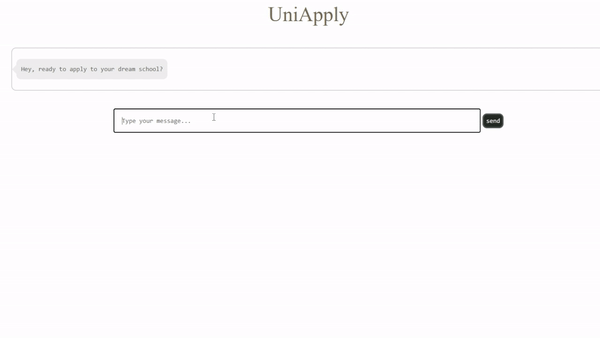
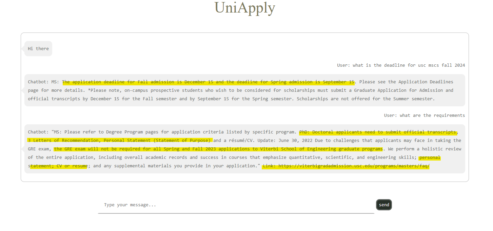

# About the project
This is an implementation of the Retrieval-Augmented Generation (RAG) model by [Langchain](https://www.langchain.com/), and a chatbot interface built with [Django](https://www.djangoproject.com/) using application F&Q collected from universities around the world. 

<div align="center">
<p class="image-cropper">
    
</p> UniApply Interface 
</div>
<br>

Regarding the RAG, we prepare the data in advance instead of implementing real-time retrieval. Since most application information do not vary much throughout the year, we only have to update the information yearly, therefore there is no need to do realtime search to lower the computation and development cost.   
The vector-databse we use in this project is created using [FAISS](https://faiss.ai/index.html), it is a library for efficient similarity search and clustering of dense vectors. The embedding and generation model we use is offered by OpenAI GPT-3.5 for comparison.
<p align="center">

<br> The Implementation of Partial RAG </br>
</p>

The results showed that with the RAG implemented with our model, it can providing accurate information and link for your reference. This mechanism also allows user to ask free form questions, instead of looking through the F&Q going through the questions one by one or `ctrl-F` and try to figure out which is the correct answer, non-native speakers and also confused user can easily get the right answer. 
<p align="center">

<br> Comparison on GPT-3.5 and GPT3.5 with RAG </br>
</p>

# Get Started
## Installation
```bash
!pip install openai
!pip install tiktoken
!pip install langchain
!pip install faiss-cpu
!pip install text_generation
!pip install django
```
## ENV VAR setting
```bash
export "OPENAI_API_KEY" = 'YOUR_OPENAI_KEY'
export "DJANGO_SECRET_KEY" = 'YOUR_DJANGO_SECRET_KEY'
```
## Run
```
cd UniApply_Chatbot
python manage.py runserver 8003 -- you can change port 
```
## Add your own data
You can put your own data in the data folder under `./UniApply_Chatbot/data/`, the file should be in excel (`.xlsx` ) format.

Also the columns are Question, Answer, Tags, Link respectively.
* **Question**: The questions from the F&Q
* **Answer**: The corresponding answer from the F&Q
* **Tags**: Stores the school, department, degree and category information, for example: USC , Vertibi, Master, PhD, Application
* **Link** : link of the F&Q website

<p align="right">(<a href="#readme-top">back to top</a>)</p>

# Usage
The overall structure of this project, you can modify it as you like, also any recommendation is welcomed.
### Important files
* `./UniApply_Chatbot/data/` : the folder where we store the f&q data to be put in the vector space
* `manage.py`: the file that runs everything `main` is in here
* `view.py`: modify responce and custom prompt templates
* `static`, `template`: modify the appearance of the chatbot under here
```bash
└──LLM_RAG_UniApply
   ├──UniApply_Chatbot # the whole django project
   │  ├──data 
   │  ├──UniApply_Chatbot
   │  ├──manage.py 
   │  ├──db.sqlite3
   │  └──UniApply # the chatbot
   │     ├──static 
   │     ├──admin.py
   │     ├──templates 
   │     ...
   │     └──views.py 
   ├──LICENSE
   ├──README.md
   └──img
```