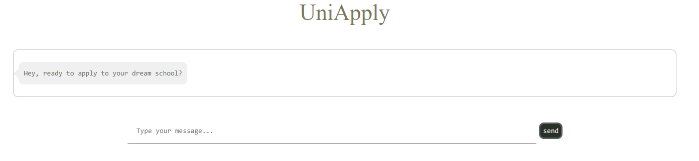

<h1 align="center">UniApply </h1>

<p align="center">
    <a href="https://github.com/FlagOpen/FlagEmbedding">
            
    </a>
    <a href="https://github.com/stephanie0324/LLM_RAG_UniApply/stargazers">
        
    </a>
    <a href="https://github.com/stephanie0324/LLM_RAG_UniApply/forks">
        
    </a>
    <a href="https://github.com/stephanie0324/LLM_RAG_UniApply/issues">
        
    </a>
</p>
<div align="center">
    
    <p>
    This is a Uni/Colledge Application F&Q Chatbot through RAG implementation.
    <br>  
    Ask freely and get the most accurate information with link.
    <br>
    <h5 align="center">
    <p>
        <a href=#about-the-project>About</a> |
        <a href=#new-updates>News</a> |
        <a href="#project-lists">Projects</a> |
        <a href=#usage>Usage</a> |
        <a href="#roadmap">Roadmap</a> |
        <a href="#contributing">Contributing</a> |
        <a href="#license">License</a> 
    </p>
  </h5>
  </p>
</div>

# About the project
<div align="center">
    
</div>

This is an implementation of the Retrieval-Augmented Generation (RAG) model by [Langchain](https://www.langchain.com/), with application F&Q collected from universities around the world. Providing accurate information and link for your reference, also allows user to ask free form questions.
<p align="center">

<br> Comparison on GPT-3.5 and GPT3.5 with RAG </br>
</p>

# Usage
### Things to install
```bash
!pip install openai
!pip install tiktoken
!pip install langchain
!pip install faiss-cpu
!pip install text_generation
!pip install django
```
### ENV VAR setting
```bash
export "OPENAI_API_KEY" = 'YOUR_OPENAI_KEY'
export "DJANGO_SECRET_KEY" = 'YOUR_DJANGO_SECRET_KEY'
```
### Run
```
cd UniApply_Chatbot
python manage.py runserver 8003 -- you can change port 
```


