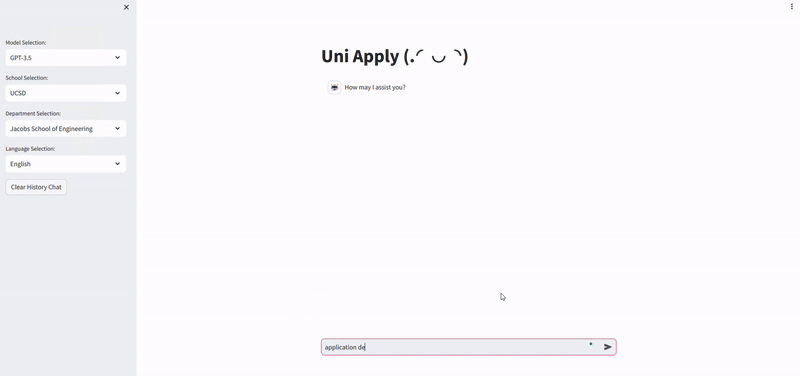
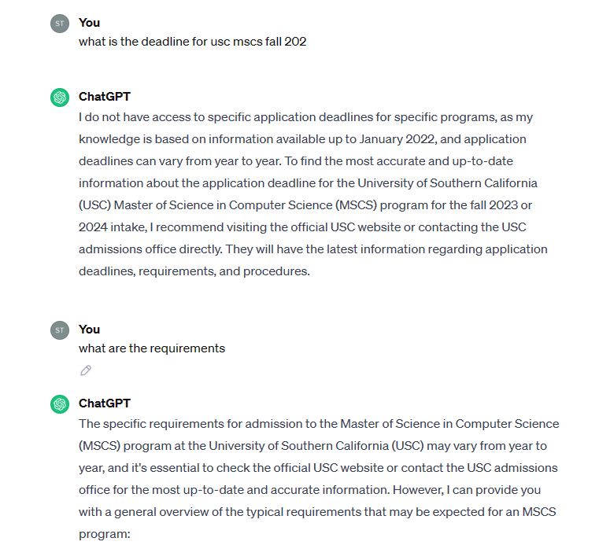
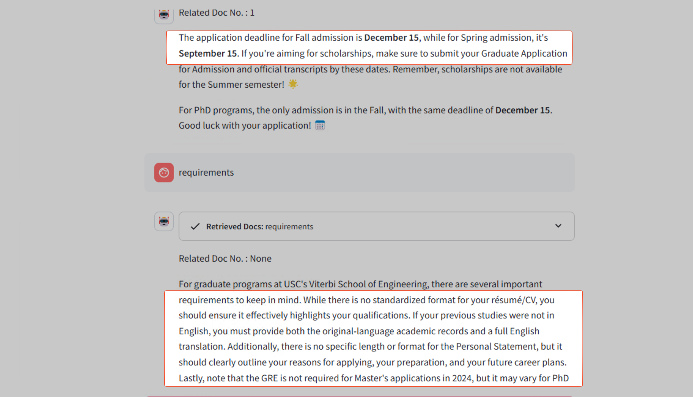

# About the project
### Table of Contents  
[TOC]  

---
This is an implementation of the Retrieval-Augmented Generation (RAG) model by [Langchain](https://www.langchain.com/), and a chatbot interface built with [Streamlit](https://streamlit.io/) using application F&Q collected from universities around the world. 

<div align="center">
<p class="image-cropper">
    
</p> UniApply Interface 
</div>
<br>


The results showed that with the RAG implemented with our model, it can providing accurate information and link for your reference. This mechanism also allows user to ask free form questions, instead of looking through the F&Q going through the questions one by one or `ctrl-F` and try to figure out which is the correct answer, non-native speakers and also confused user can easily get the right answer. 
<p align="center">

<br> Comparison on GPT-3.5 and GPT3.5 with RAG </br>
</p>

<p align="right">(<a href="#readme-top">back to top</a>)</p>


# Add your own data
You can put your own data in the data folder under `./app/data`, the file should be in excel (`.xlsx` ) format.

Also the columns are Question, Answer, Tags, Link respectively.
* **Question**: The questions from the F&Q
* **Answer**: The corresponding answer from the F&Q
* **Tags**: Stores the school, department, degree and category information, for example: USC , Vertibi, Master, PhD, Application
* **Link** : link of the F&Q website

<p align="right">(<a href="#readme-top">back to top</a>)</p>

# Get Started
The overall structure of this project, you can modify it as you like, also any recommendation is welcomed.

## Main Files and Folder Descriptions  
- `app/data/`: Folder containing source data for the program  
- `app/index_data/`: Directory for storing FAISS index files
* `app/my_faiss.py`: Implementation of Data procssing and building FAISS index  
- `app/rag.py`: Implementation of RAG using LangChain routing  
- `app/web.py`: The main execution file and webpage for the RAG Demo  
- `app/prompt.py`: where you keep the prompts  
## For Development
To deploy the application simply go to `deploy` folder.  
1. Modify `.env` file
    * OPENAI_API_KEY
    * HOST_PORT
    * GPU_DEVICE
    
    (Retrieval Related Settings) 
    > [!NOTE] you can change below settings regarding to the documents and language you have prepared
    * EMBEDDING_MODEL_NAME
    * RETRIEVER_RETURN_TOP_N

2. Enter the container
```
bash script/run-dev-mode.sh 
``` 

3. Run the application
```
streamlit run --server.port 7860 web.py
```
<p align="right">(<a href="#readme-top">back to top</a>)</p>

# Project Structure
```bash
└──components
   ├──Django_ver  
   ├──Streamlit_ver # the whole streamlit project
   │  ├──app 
   │     ├──data 
   │     ...
   │     ├──web.py # the main web 
   │     ├──rag.py.sh # the main chain
   │     └──my_faiss.py # data preprocessing and index building
   │  ├──img
   │  └──script 
   │     ├──build-docker-image.sh 
   │     ├──get-image-name.sh
   │     └──run-dev-mode.sh
   │  ├──Dockerfile
   │  └──Readme.md
   ├──LICENSE
   ├──README.md
   └──img
```

<p align="right">(<a href="#readme-top">back to top</a>)</p>